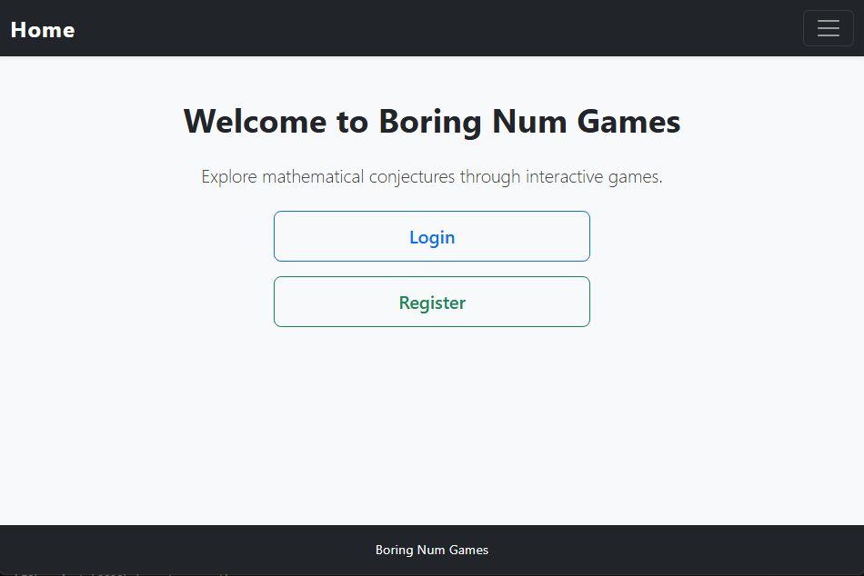

# Boring Num Games

Welcome to **Boring Num Games**, my final project for Harvard's CS50 Web Programming with Python and JavaScript course. This web application explores mathematical conjectures through interactive games and visualizations, built with Django and JavaScript.

[**CS50W Final Project Especifications**](https://github.com/AFKMartin/CS50W-Final-Project/blob/main/CS50W-Capstone-requirements.md)



## What is Boring Num Games?

Boring Num Games is an educational platform that makes abstract mathematical concepts tangible through interactive gameplay. Users can explore three (you can add more if you like) famous mathematical conjectures:

- **Collatz Conjecture Game**: Test numbers to see how many steps it takes to reach 1, with mountain and spiral visualizations
- **Riemann Hypothesis Explorer**: Visualize the Riemann zeta function and see how it approximates prime number distribution
- **Goldbach Conjecture Game**: Race against time to find prime pairs that sum to even numbers

The platform features user profiles with customizable avatars and bios, an achievement system that rewards mathematical exploration, and competitive leaderboards tracking the best performances across all games.

---

## Distinctiveness and Complexity

### Why This Project is Distinct

Boring Num Games is fundamentally different from the course's previous projects in both purpose and implementation:

**Not a Social Network (Project 4):** While this project includes user profiles, it is not a social network. There are no posts, followers, likes, or social interactions between users. The profiles serve solely to track individual game performance, achievements, and rankings. Users cannot communicate with each other or view each other's activity feeds. The focus is on individual mathematical exploration and personal improvement, not social engagement.

**Not an E-Commerce Site (Project 2):** This project has no commercial aspect whatsoever. There are no products, shopping carts, transactions, or bidding mechanisms. Instead, it's an educational platform centered on interactive mathematical games and visualizations.

**Unique Educational Purpose:** Unlike any previous project, Boring Num Games bridges mathematics and web development. It makes abstract mathematical concepts (Collatz sequences, Riemann zeta functions, prime number theory) accessible through interactive visualizations and gamification. This educational angle is entirely distinct from the social networking, commerce, or email applications covered in CS50W.

### Why This Project is Complex

The complexity of Boring Num Games extends far beyond the scope of previous course projects in several key areas:

**Mathematical Implementation:** The project implements complex mathematical algorithms not covered in CS50W. The Collatz game calculates sequences up to 1,000 steps tracking maximum values. The Riemann explorer computes the Riemann zeta function, logarithmic integral (Li(x)), Möbius function, and implements the Riemann R function with oscillatory corrections using the first 200 non-trivial zeros of the zeta function. The Goldbach game includes prime-checking algorithms for real-time validation. These implementations required significant mathematical research and algorithmic optimization.

**Advanced Visualizations:** The project features multiple sophisticated visualization techniques. The Collatz game includes two distinct canvas-based visualizations (mountain chart and spiral chart), both rendering complex mathematical sequences with dynamic scaling, gradient fills, and intelligent labeling. The Riemann explorer uses Chart.js to visualize function behavior and prime distribution with multiple datasets. These visualizations required deep understanding of HTML5 Canvas API and mathematical coordinate systems.

**Achievement System Architecture:** I implemented a flexible achievement system with automatic unlocking logic. The system includes a helper function (`achievements_helper`) that dynamically checks user performance against achievement thresholds using configurable comparison operators (greater-than-or-equal, less-than-or-equal). This required careful database design with a many-to-many relationship through the UserAchievement model, ensuring achievements unlock only once and persist across sessions.

**Complex Database Queries:** The ranking system uses advanced Django ORM features including aggregations (`Max`, `Min`), annotations, and multi-level filtering. For each game type, the application calculates rankings by finding each user's best score, then counting how many users performed better. This required understanding of subqueries and aggregate functions beyond what was covered in the course.

**AJAX Integration:** The Goldbach game implements asynchronous score saving using the Fetch API with proper CSRF token handling. This allows scores to be saved without page reloads, providing a seamless user experience. The implementation required understanding of Django's CSRF protection mechanisms and JSON response handling.

**Responsive Canvas Design:** Making canvas-based visualizations mobile-responsive required custom scaling logic and overflow handling. The canvases maintain readability across devices while displaying complex mathematical data, a challenge not addressed in any course project.

---

## Files and Directory Structure

### Python Files

**`models.py`** - Defines four interconnected Django models:
- `Profile`: Extends Django's User model with avatar (ImageField) and bio fields, using signals for automatic creation
- `GameScore`: Stores user performance across three game types (collatz_steps, collatz_max, goldbach_time)
- `Achievement`: Defines unlockable achievements with thresholds and comparison operators
- `UserAchievement`: Many-to-many relationship tracking which users unlocked which achievements

**`views.py`** - Contains all view logic:
- Authentication views: `register`, `login_view`, `logout_view`
- Profile views: `profile_view` (displays user stats and rankings), `edit_profile` (handles avatar/bio updates)
- Game views: `collatz_game` (processes Collatz sequences, saves high scores), `riemann`, `goldbach`, `goldbach_save_time` (AJAX endpoint)
- Utility views: `rankings` (displays top 3 users per game), `index`, `riemannMore`
- Helper function: `achievements_helper` (automatic achievement unlocking logic)

**`utils.py`** - Mathematical helper functions:
- `collatz_seq(n, max_steps)`: Computes Collatz sequences with step limits, returns sequence, step count, and max value

**`urls.py`** - URL routing for endpoints including authentication, profiles, games, and rankings

**`admin.py`** - Registers all models for Django admin interface

### JavaScript Files (in `static/explorer/`)

**`collatz.js`** - Collatz game visualization:
- `drawMountainChart()`: Renders mountain-style area chart using HTML5 Canvas with gradients and labels
- `drawSpiralChart()`: Creates spiral visualization with color-coded nodes based on value magnitude
- Bootstrap tab integration for switching between visualizations
- Fade-in animations for descriptions

**`goldbach.js`** - Goldbach game logic:
- `generateEvenNumbers()`: Creates random set of 10 even numbers between 10-300
- `startGame()`: Initializes game state, starts timer
- `isPrime()`: Prime number checker using trial division
- `saveGoldbachTime()`: Sends score to Django via AJAX with CSRF protection
- Form validation and feedback system

**`riemann.js`** - Riemann visualization:
- `zetaReal(s, terms)`: Computes Riemann zeta function for real s > 1
- `isPrime()`, `primeCount()`: Prime counting function PI(x)
- `li(x)`: Logarithmic integral approximation using numerical integration
- `mobius(n)`: Möbius function implementation
- `riemannR(x, numTerms)`: Riemann R function with Möbius weighting
- `riemannApprox(x, k)`: Explicit formula using first 200 zeta zeros for oscillatory corrections
- Chart.js integration with dynamic updates
- Hardcoded array of 200 non-trivial zeta zeros

**`fade.js`** - Simple fade-in animation timing for aesthetic purposes

### HTML Templates (in `templates/explorer/`)

**`layout.html`** - Base template

**`index.html`** - Landing page with game links

**`collatz.html`** - Collatz game interface

**`goldbach.html`** - Goldbach timed game interface

**`riemann.html`** - Riemann zeta visualizations

**`riemann-more.html`** - Extended Riemann information

**`profile.html`** - User profile displaying:
- Avatar and bio with edit functionality
- Game statistics with dynamic rankings
- Achievement cards in responsive grid

**`ranking.html`** - Leaderboards for all three games

**`register.html`**, **`login.html`** - Authentication pages

### Static Files

**`styles.css`** - Custom styling including:
- Fade-in animation keyframes
- Responsive grid layouts with media queries for rankings (3 columns on large, 2 on medium, 1 on small)
- Profile avatar styling (circular, 120px)
- Achievement card styling with hover effects
- Canvas borders and backgrounds
- Bootstrap navbar customization
- Sticky footer implementation

---

## How to Run

### Prerequisites
- Python 3.7 or higher
- pip (Python package manager)

### Installation

1. **Install dependencies:**
```bash
pip install -r requirements.txt
```

2. **Run migrations:**
```bash
python manage.py makemigrations
python manage.py migrate
```

3. **Create achievements (Optional):**
```bash
python manage.py create_achievements
```

4. **Create a superuser (for admin access):**
```bash
python manage.py createsuperuser
```
NOTE: If you want you can also create a normal user using the register page.

5. **Acces the application:**
```bash
python manage.py runserver
```

Navigate to `http://127.0.0.1:8000` to test the page and play the games.

6. **Acces the admin**

Navigate to `http://127.0.0.1:8000/admin` to use the admin interface (with the superuser) and for example add Achievement objects with:
- Name, description, icon (emoji)
- Game type (collatz_steps, collatz_max, or goldbach_time)
- Threshold value
- Comparison operator (gte or lte)


### Usage

1. **Register an account** to access all features
2. **Play games** to earn scores and unlock achievements
3. **View your profile** to see personal records and rankings
4. **Check leaderboards** to compare with other players
5. **Customize profile** with avatar and bio

---

## Additional Information

### Design Decisions

**Achievement System Flexibility:** Achievements use a configurable comparison system (gte/lte) because some metrics reward high values (steps, max value) while others reward low values (completion time). This makes the system extensible for future game types.

**Score Storage Strategy:** Instead of storing only the user's best score, all scores are saved with timestamps. This allows for future features like progress tracking and statistics, while current rankings query only the best scores.

**Manual Achievement Creation:** Achievements must be created via Django admin rather than being hardcoded. This design allows non-programmers to add new achievements without code changes, making the platform more maintainable.

### Known Limitations

- Collatz sequences are capped at 1,000 steps to prevent infinite loops or browser hangs
- Riemann visualizations use only the first 200 non-trivial zeros (hardcoded)
- Prime checking in Goldbach uses trial division, limiting performance for very large primes
- Canvas visualizations are not accessible to screen readers

### Scalability

- Add more mathematical games 
- Implement historical score tracking graphs
- Create difficulty levels for each game

### Technologies Used

- **Backend:** Django, Python
- **Frontend:** JavaScript, HTML5, CSS
- **Frameworks:** Bootstrap, Chart.js
- **Database:** SQLite3
- **APIs:** HTML5 Canvas API, Fetch API

---

## Mobile Responsiveness

The application is fully mobile-responsive:
- Bootstrap's responsive grid system and navbar
- Custom CSS media queries for ranking grids
- Canvas elements with max-width and overflow handling
- Viewport meta tag for proper mobile scaling

---

## About the Developer

[**My Github**](https://github.com/AFKMartin)

---

## License

This project is submitted as coursework for Harvard's CS50W.